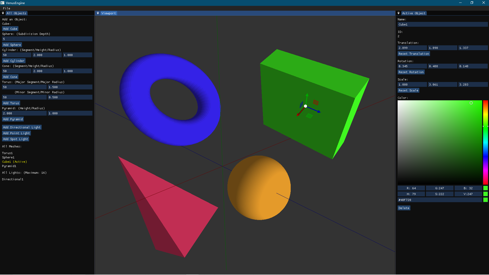

# VenusEngine

A Graphics Engine based on C++ and OpenGL.



--------------------------------------------------------------------------------

Download:

run ```git clone https://github.com/DierF/VenusEngine.git```

--------------------------------------------------------------------------------

BUILD:

cmake required!

Windows: (Visual Studio 2022 Recommended)

run ```./build_windows.bat```

solution file "VenusEngine.sln" will be generated in folder "build"

In Visual Studio, set VenusEngine as the startup project before execution

<br>

Linux:

run ```bash build_linux.sh```

executable "VenusEngine" will be generated in folder "build"

--------------------------------------------------------------------------------

Layout:

1. All Objects Window:

Add new mesh OR new light source.

Display all existing meshes and light sources.

Left click existing object name to select.

2. Active Object Window:

Display selected object information.

Update selected object information.

3. Viewport Window:

Display the view of the scene from the editor camera.

Left click on the scene to select/unselect mesh.

Hold mouse right button while dragging mouse to move editor camera's direction.

Hold mouse right button and shift key while dragging mouse to move editor camera's position.

Press P to reset editor camera's direction and position.

Shortcuts:

A - Enable/Disable World Axis (Red/Green/Blue for X/Y/Z)<br>

Esc - Quit program

--------------------------------------------------------------------------------

3rdParty libraries included:
glfw,
glad,
imgui,
imguizmo